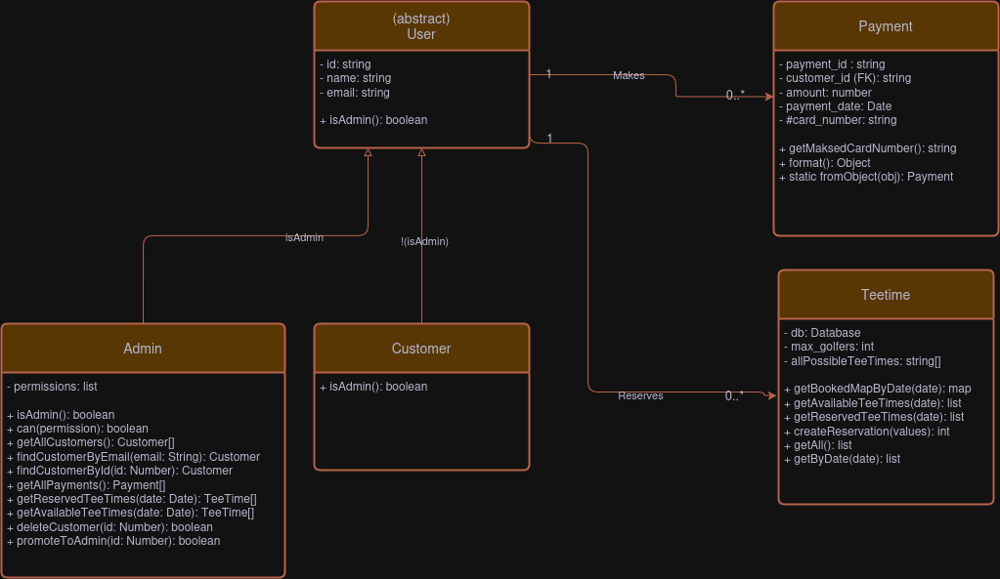

# Stiles Golf Course - Online Tee Times
This project is to demonstrate taking a local Golf Course into the digital era, providing the core functionality
of allowing patrons to book and pay for teetimes online. It allows users to login, book a tee time reservation, and
pay for the service using Square Payments API.

The User class has two subclasses, Customer and Admin. Customer can only book Teetimes, change their account details and make a Payments.

An Admin can generate reports, view payments, delete Users, and Promote Users to Admin. They also have all the functionality of a Customer, because they will want to book and pay for Teetimes also.

## UML Class Diagram
